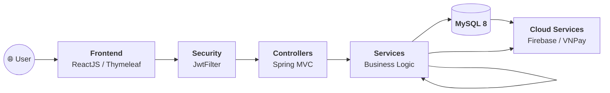

<h1 align="center">💪 Gym Management System</h1>

<p align="center">
  <strong>Hệ thống quản lý phòng gym toàn diện — từ đăng ký gói tập, quản lý lịch tập, đến thanh toán và chat thời gian thực.</strong>
</p>

<p align="center">
  
  
  
  
  
</p>

---

## 📋 Mục lục

- [Giới thiệu](#-giới-thiệu)
- [Tính năng chính](#-tính-năng-chính)
- [Kiến trúc hệ thống](#-kiến-trúc-hệ-thống)
- [Công nghệ sử dụng](#-công-nghệ-sử-dụng)
- [Cài đặt & Chạy dự án](#-cài-đặt--chạy-dự-án)
- [Thành viên nhóm](#-thành-viên-nhóm)

---

## 📌 Giới thiệu

**Gym Management System** là ứng dụng web quản lý phòng gym được xây dựng bởi **Nhóm 12**, bao gồm đầy đủ các chức năng từ quản lý thành viên, lịch tập, thanh toán trực tuyến qua **VNPay**, đến chat thời gian thực giữa hội viên và huấn luyện viên.

---

## ✨ Tính năng chính

- 👤 **Quản lý người dùng & Phân quyền**: Admin, Staff, Trainer, Member (JWT Token)
- 🏋️ **Quản lý gói tập & Đăng ký**: Đăng ký, gia hạn gói tập, xem lịch sử
- 💳 **Thanh toán VNPay**: Tích hợp cổng thanh toán trực tuyến
- 💬 **Chat thời gian thực**: Chat 1-1 giữa HV & Trainer (Firebase)
- 📊 **Thống kê & Báo cáo**: Doanh thu, hội viên mới (Chart.js)

---

## 🏗️ Kiến trúc hệ thống



---

## 🛠️ Công nghệ sử dụng

| Tầng | Công nghệ |
|------|-----------|
| **Backend** | Java 17, Spring MVC, Spring Security, Hibernate ORM, JWT, JavaMail |
| **Frontend** | ReactJS 18, React Router v6, Axios, Tailwind CSS, ShadCN UI |
| **Database & Services** | MySQL 8, Firebase Realtime DB, VNPay Payment API |

---

## 🚀 Cài đặt & Chạy dự án

```bash
# Backend
cd GymManagementApp && mvn clean package -DskipTests

# Frontend
cd GymManagementWebb/gymmanagementweb && npm install && npm start
```

---

## 🤝 Thành viên nhóm

| Thành viên | GitHub |
|------------|--------|
| Trần Lộc | [@Tranloc12](https://github.com/Tranloc12) |

---

<p align="center">
  Made with ❤️ by <strong>Nhóm 12</strong>
</p>
