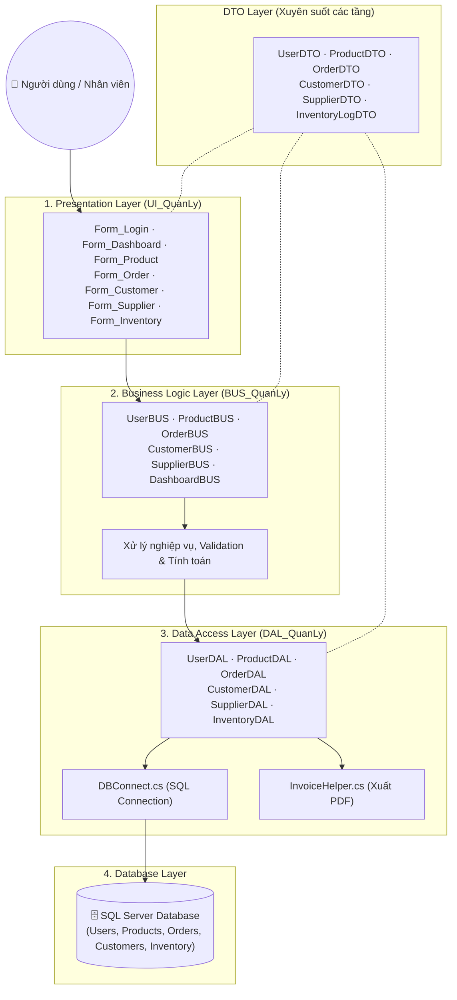

<h1 align="center">🛒 Phần Mềm Quản Lý Bán Hàng</h1>

<p align="center">
  <strong>Ứng dụng desktop quản lý bán hàng toàn diện — sản phẩm, đơn hàng, khách hàng, nhà cung cấp và thống kê doanh thu.</strong>
</p>

<p align="center">
  
  
  
  
</p>

---

## 📋 Mục lục

- [Giới thiệu](#-giới-thiệu)
- [Tính năng chính](#-tính-năng-chính)
- [Kiến trúc hệ thống](#-kiến-trúc-hệ-thống)
- [Công nghệ sử dụng](#-công-nghệ-sử-dụng)
- [Cài đặt & Chạy dự án](#-cài-đặt--chạy-dự-án)
- [Cấu trúc thư mục](#-cấu-trúc-thư-mục)
- [Thành viên nhóm](#-thành-viên-nhóm)

---

## 📌 Giới thiệu

**Phần Mềm Quản Lý Bán Hàng** là ứng dụng desktop được xây dựng bằng **C# Windows Forms** trên nền tảng **.NET 8**, áp dụng mô hình kiến trúc **3 lớp (Three-Layer Architecture)** nhằm tách biệt rõ ràng giữa giao diện, nghiệp vụ và truy cập dữ liệu.

---

## ✨ Tính năng chính

- 👤 **Quản lý người dùng**: Đăng nhập (BCrypt), phân quyền Admin / Nhân viên, lấy lại mật khẩu.
- 📦 **Quản lý sản phẩm & Kho**: Thêm/sửa/xóa sản phẩm, danh mục, nhật ký tồn kho.
- 🛒 **Quản lý bán hàng & Hóa đơn**: Tạo đơn hàng, xuất hóa đơn PDF (QuestPDF).
- 📊 **Thống kê & Dashboard**: Biểu đồ doanh thu, sản phẩm bán chạy.

---

## 🏗️ Kiến trúc 3 Lớp (Chi tiết vừa vặn)



---

## 🛠️ Công nghệ sử dụng

| Tầng | Công nghệ / Thư viện |
|------|----------------------|
| **Framework** | .NET 8 (Windows Forms) |
| **Database** | Microsoft SQL Server (ADO.NET) |
| **Mã hóa** | BCrypt.Net (Mật khẩu) |
| **Xuất PDF** | QuestPDF / iText |

---

## 🚀 Cài đặt & Chạy dự án

```bash
git clone https://github.com/Tranloc12/DoAnQuanLyBanHang.git
# Mở solution trong VS2022 -> Cấu hình DBConnect.cs -> Nhấn F5
```

---

## 📁 Cấu trúc thư mục

```
DoAnQuanLyBanHang/
├── DTO_QuanLy/                    # Data Transfer Object Layer
├── DAL_QuanLy/                    # Data Access Layer
├── BUS_QuanLy/                    # Business Logic Layer
├── UI_QuanLy/                     # Windows Forms UI
├── DoAnQuanLyBanHang.sln          # Solution file
└── BaoCaoLTCSDL.docx              # Báo cáo đồ án
```

---

## 🤝 Thành viên nhóm

| Thành viên | MSSV | GitHub |
|------------|------|--------|
| Trần Quang Lộc | 2251012087 | [@Tranloc12](https://github.com/Tranloc12) |

---

<p align="center">
  Made with ❤️ by <strong>Trần Quang Lộc</strong> & Team
</p>
