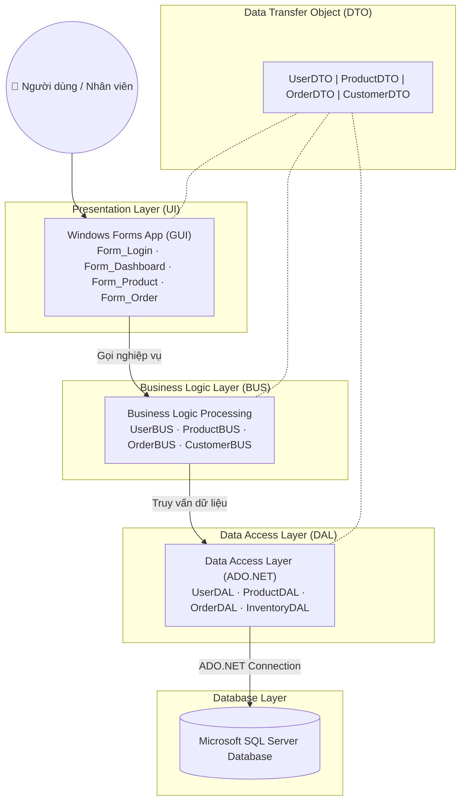

<h1 align="center">🛒 Phần Mềm Quản Lý Bán Hàng</h1>

<p align="center">
  <strong>Ứng dụng desktop quản lý bán hàng toàn diện — sản phẩm, đơn hàng, khách hàng, nhà cung cấp và thống kê doanh thu.</strong>
</p>

<p align="center">
  
  
  
  
</p>

---

## 📋 Mục lục

- [Giới thiệu](#-giới-thiệu)
- [Tính năng chính](#-tính-năng-chính)
- [Kiến trúc hệ thống](#-kiến-trúc-hệ-thống)
- [Công nghệ sử dụng](#-công-nghệ-sử-dụng)
- [Cài đặt & Chạy dự án](#-cài-đặt--chạy-dự-án)
- [Cấu trúc thư mục](#-cấu-trúc-thư-mục)
- [Cơ sở dữ liệu](#-cơ-sở-dữ-liệu)
- [Thành viên nhóm](#-thành-viên-nhóm)

---

## 📌 Giới thiệu

**Phần Mềm Quản Lý Bán Hàng** là ứng dụng desktop được xây dựng bằng **C# Windows Forms** trên nền tảng **.NET 8**, áp dụng mô hình kiến trúc **3 lớp (Three-Layer Architecture)** nhằm tách biệt rõ ràng giữa giao diện, nghiệp vụ và truy cập dữ liệu.

Dự án được phát triển như một đồ án môn học **Lập trình Cơ sở Dữ liệu**, bao gồm đầy đủ chức năng từ quản lý sản phẩm, đơn hàng, khách hàng, nhà cung cấp đến xuất hóa đơn PDF và thống kê doanh thu.

---

## ✨ Tính năng chính

### 👤 Quản lý người dùng
- Đăng nhập với tài khoản và mật khẩu (mã hóa bcrypt)
- Phân quyền: **Admin** và **Nhân viên**
- Quên mật khẩu / đặt lại mật khẩu
- Quản lý danh sách tài khoản nhân viên

### 📦 Quản lý sản phẩm
- Thêm, sửa, xóa sản phẩm
- Phân loại sản phẩm theo danh mục (Category)
- Tìm kiếm và lọc sản phẩm
- Quản lý tồn kho & nhập hàng (Inventory)

### 🛍️ Quản lý đơn hàng (Order)
- Tạo đơn hàng mới, thêm nhiều sản phẩm vào một đơn
- Cập nhật trạng thái đơn hàng
- Xem lịch sử đơn hàng theo khách hàng
- **Xuất hóa đơn PDF** (dùng thư viện QuestPDF/iText)

### 👥 Quản lý khách hàng (Customer)
- Thêm, sửa, xóa thông tin khách hàng
- Tìm kiếm theo tên, số điện thoại, email
- Xem lịch sử mua hàng của từng khách

### 🏭 Quản lý nhà cung cấp (Supplier)
- Thêm, sửa, xóa nhà cung cấp
- Liên kết nhà cung cấp với sản phẩm

### 📊 Dashboard & Thống kê
- Tổng doanh thu theo ngày / tháng / năm
- Sản phẩm bán chạy nhất
- Số đơn hàng mới, khách hàng mới
- Biểu đồ trực quan trên giao diện dashboard

---

## 🏗️ Kiến trúc hệ thống



### Giải thích các tầng

| Tầng | Thư mục | Vai trò |
|------|---------|---------|
| **DTO** | `DTO_QuanLy/` | Các class dữ liệu thuần túy, truyền dữ liệu giữa các tầng |
| **DAL** | `DAL_QuanLy/` | Truy vấn SQL Server trực tiếp qua ADO.NET |
| **BUS** | `BUS_QuanLy/` | Xử lý nghiệp vụ, validation, gọi DAL |
| **UI** | `UI_QuanLy/` | Giao diện Windows Forms, gọi BUS |

---

## 🛠️ Công nghệ sử dụng

| Công nghệ | Mô tả |
|-----------|-------|
| **C# / .NET 8** | Ngôn ngữ & nền tảng chính |
| **Windows Forms** | Framework giao diện desktop |
| **SQL Server** | Hệ quản trị cơ sở dữ liệu |
| **ADO.NET** | Kết nối và truy vấn database |
| **BCrypt.Net** | Mã hóa mật khẩu |
| **QuestPDF / iText** | Xuất hóa đơn dạng PDF |
| **Visual Studio 2022** | IDE phát triển |

---

## 🚀 Cài đặt & Chạy dự án

### Yêu cầu môi trường

- **Visual Studio 2022** (hoặc mới hơn) với workload **.NET Desktop Development**
- **.NET 8 SDK**
- **SQL Server 2019+** (hoặc SQL Server Express)
- **SQL Server Management Studio (SSMS)** — để import database

---

### Bước 1: Clone repository

```bash
git clone https://github.com/Tranloc12/DoAnQuanLyBanHang.git
cd DoAnQuanLyBanHang
```

### Bước 2: Tạo Database

1. Mở **SQL Server Management Studio**
2. Kết nối vào SQL Server instance của bạn
3. Tạo database mới tên `QuanLyBanHang`:

```sql
CREATE DATABASE QuanLyBanHang;
```

### Bước 3: Cấu hình Connection String

Mở file `DAL_QuanLy/DBConnect.cs` và chỉnh sửa connection string:

```csharp
private static string connectionString =
    "Server=YOUR_SERVER_NAME;Database=QuanLyBanHang;Trusted_Connection=True;TrustServerCertificate=True;";
```

### Bước 4: Build & Chạy

1. Mở file `DoAnQuanLyBanHang.sln` bằng **Visual Studio 2022**
2. Nhấn **Ctrl + Shift + B** để Build solution
3. Nhấn **F5** hoặc nút ▶️ để chạy ứng dụng

---

## 📁 Cấu trúc thư mục

```
DoAnQuanLyBanHang/
│
├── DTO_QuanLy/                    # Tầng Data Transfer Object
├── DAL_QuanLy/                    # Tầng Data Access Layer
├── BUS_QuanLy/                    # Tầng Business Logic
├── UI_QuanLy/                     # Tầng giao diện (Windows Forms)
├── DoAnQuanLyBanHang.sln          # Solution file
└── BaoCaoLTCSDL.docx              # Báo cáo đồ án
```

---

## 🤝 Thành viên nhóm

| Thành viên | MSSV | GitHub |
|------------|------|--------|
| Trần Quang Lộc | 2251012087 | [@Tranloc12](https://github.com/Tranloc12) |

---

<p align="center">
  Made with ❤️ by <strong>Trần Quang Lộc</strong> & Team
</p>
