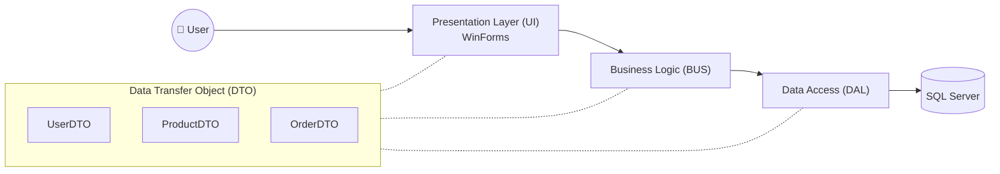

<h1 align="center">🛒 Phần Mềm Quản Lý Bán Hàng</h1>

<p align="center">
  <strong>Ứng dụng desktop quản lý bán hàng toàn diện — sản phẩm, đơn hàng, khách hàng, nhà cung cấp và thống kê doanh thu.</strong>
</p>

<p align="center">
  
  
  
  
</p>

---

## 📋 Mục lục

- [Giới thiệu](#-giới-thiệu)
- [Tính năng chính](#-tính-năng-chính)
- [Kiến trúc hệ thống](#-kiến-trúc-hệ-thống)
- [Công nghệ sử dụng](#-công-nghệ-sử-dụng)
- [Cài đặt & Chạy dự án](#-cài-đặt--chạy-dự-án)
- [Cấu trúc thư mục](#-cấu-trúc-thư-mục)
- [Thành viên nhóm](#-thành-viên-nhóm)

---

## 📌 Giới thiệu

**Phần Mềm Quản Lý Bán Hàng** là ứng dụng desktop được xây dựng bằng **C# Windows Forms** trên nền tảng **.NET 8**, áp dụng mô hình kiến trúc **3 lớp (Three-Layer Architecture)** nhằm tách biệt rõ ràng giữa giao diện, nghiệp vụ và truy cập dữ liệu.

---

## ✨ Tính năng chính

### 👤 Quản lý người dùng
- Đăng nhập với tài khoản và mật khẩu (mã hóa bcrypt)
- Phân quyền: **Admin** và **Nhân viên**
- Quên mật khẩu / đặt lại mật khẩu

### 📦 Quản lý sản phẩm & Đơn hàng
- Thêm, sửa, xóa sản phẩm, danh mục
- Tạo đơn hàng, cập nhật trạng thái
- **Xuất hóa đơn PDF** & Thống kê doanh thu

---

## 🏗️ Kiến trúc hệ thống



### Giải thích các tầng

| Tầng | Thư mục | Vai trò |
|------|---------|---------|
| **DTO** | `DTO_QuanLy/` | Truyền dữ liệu giữa các tầng |
| **DAL** | `DAL_QuanLy/` | Truy vấn SQL Server qua ADO.NET |
| **BUS** | `BUS_QuanLy/` | Xử lý nghiệp vụ & validation |
| **UI** | `UI_QuanLy/` | Giao diện Windows Forms |

---

## 🛠️ Công nghệ sử dụng

| Công nghệ | Mô tả |
|-----------|-------|
| **C# / .NET 8** | Ngôn ngữ & nền tảng chính |
| **Windows Forms** | Framework giao diện desktop |
| **SQL Server** | Hệ quản trị cơ sở dữ liệu |
| **ADO.NET** | Kết nối và truy vấn database |
| **QuestPDF** | Xuất hóa đơn dạng PDF |

---

## 🚀 Cài đặt & Chạy dự án

```bash
# 1. Clone repository
git clone https://github.com/Tranloc12/DoAnQuanLyBanHang.git

# 2. Mở file solution trong Visual Studio 2022
DoAnQuanLyBanHang.sln

# 3. Đổi Connection String trong DAL_QuanLy/DBConnect.cs
# 4. Nhấn F5 để chạy dự án
```

---

## 📁 Cấu trúc thư mục

```
DoAnQuanLyBanHang/
├── DTO_QuanLy/                    # Data Transfer Object
├── DAL_QuanLy/                    # Data Access Layer
├── BUS_QuanLy/                    # Business Logic Layer
├── UI_QuanLy/                     # Windows Forms UI
├── DoAnQuanLyBanHang.sln          # Solution file
└── BaoCaoLTCSDL.docx              # Báo cáo đồ án
```

---

## 🤝 Thành viên nhóm

| Thành viên | MSSV | GitHub |
|------------|------|--------|
| Trần Quang Lộc | 2251012087 | [@Tranloc12](https://github.com/Tranloc12) |

---

<p align="center">
  Made with ❤️ by <strong>Trần Quang Lộc</strong> & Team
</p>
